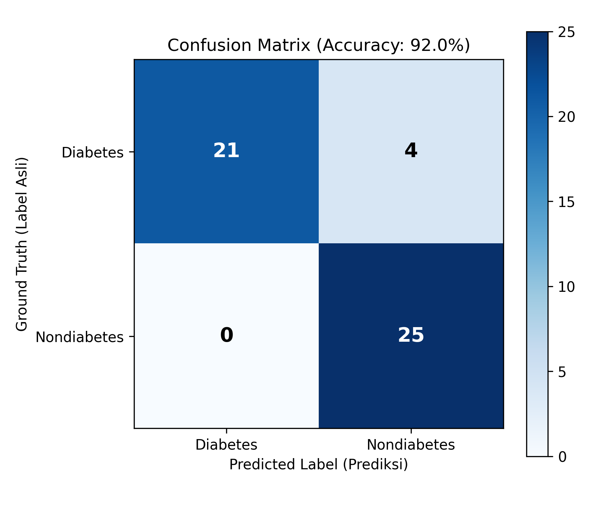
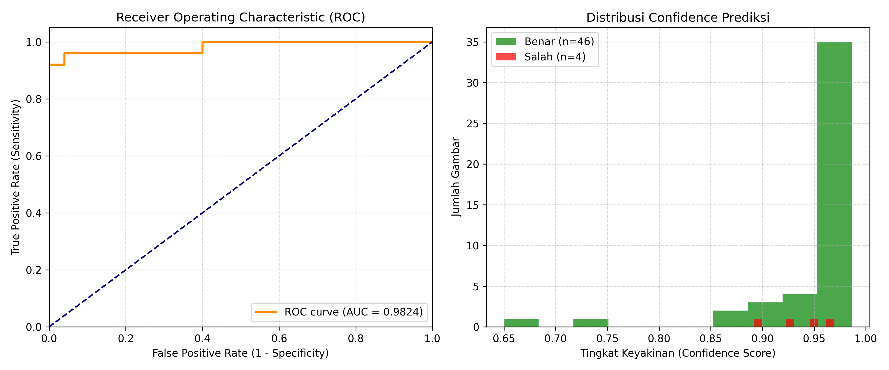

# Laporan Evaluasi Model YOLO Deteksi Diabetes

Dokumen ini memuat hasil evaluasi performa model **YOLO Diabetes Detection** terhadap dataset pengujian (**test set**):
`Testing/preprocessedcropped/test`

---

## 1. Ringkasan Eksekutif

| Parameter | Nilai | Keterangan |
| :--- | :--- | :--- |
| **Model yang Diuji** | `Andidet.AI/Diadet AI/best.pt` | Ultralytics YOLO Object Detection |
| **Dataset Uji** | `Testing/preprocessedcropped/test` | 50 citra lidah hasil pemotongan (crop) |
| **Total Sampel** | 50 citra | 25 Diabetes, 25 Nondiabetes (Balanced) |
| **Akurasi Keseluruhan** | **92.00%** | 46 dari 50 citra berhasil diprediksi dengan benar |
| **ROC-AUC Score** | **0.9824** | Kemampuan pemisahan kelas (*discriminative power*) sangat tinggi |
| **Precision (Diabetes)** | **100.00%** | Tidak ada *False Positive* sama sekali (0% false alarm) |
| **Sensitivity / Recall (Diabetes)** | **84.00%** | 21 dari 25 kasus diabetes berhasil terdeteksi |
| **Specificity (Nondiabetes)** | **100.00%** | 25 dari 25 sampel kontrol berhasil diidentifikasi tepat |
| **Rata-rata Latensi Inferensi** | **331.64 ms** | Waktu pemrosesan rata-rata per citra (CPU) |

---

## 2. Visualisasi Performa

### Confusion Matrix


### Kurva ROC & Distribusi Tingkat Keyakinan (Confidence Score)


---

## 3. Matriks Evaluasi Lengkap

### Detail Klasifikasi Per Kelas

| Kelas | Precision | Recall (Sens/Spec) | F1-Score | Total Sampel (Support) |
| :--- | :---: | :---: | :---: | :---: |
| **Diabetes** | **100.00%** | 84.00% | **91.30%** | 25 |
| **Nondiabetes** | 86.21% | **100.00%** | **92.59%** | 25 |
| **Macro Average** | 93.10% | 92.00% | 91.95% | 50 |
| **Weighted Average** | 93.10% | 92.00% | 91.95% | 50 |

### Rincian Nilai Confusion Matrix

- **True Positive (TP)**: **21 citra** (Pasien diabetes terprediksi tepat sebagai Diabetes)
- **False Negative (FN)**: **4 citra** (Pasien diabetes keliru terprediksi sebagai Nondiabetes)
- **False Positive (FP)**: **0 citra** (Bukan diabetes yang keliru terprediksi sebagai Diabetes)
- **True Negative (TN)**: **25 citra** (Bukan diabetes terprediksi tepat sebagai Nondiabetes)

> **Catatan Klinis:**
> Nilai **Precision 100%** pada deteksi Diabetes menunjukkan bahwa tidak ada risiko diagnosis positif palsu (*False Alarm*). Namun, nilai **Recall 84%** menunjukkan adanya 4 kasus diabetes yang tidak terdeteksi (*under-detection*).

---

## 4. Analisis Kesalahan Prediksi (*False Negatives*)

Keempat citra berikut berasal dari folder `Testing/preprocessedcropped/test/diabetes`, namun terdeteksi oleh model sebagai `Nondiabetes`:

| No | Nama File | Label Asli | Prediksi Model | Confidence | Koordinat Box (xyxy) |
| :---: | :--- | :---: | :---: | :---: | :--- |
| 1 | `r_d_(176).jpg` | Diabetes | Nondiabetes | 96.97% | [1.77, 2.06, 219.06, 161.94] |
| 2 | `r_d_(183).jpg` | Diabetes | Nondiabetes | 94.66% | [0.86, 1.48, 220.0, 161.46] |
| 3 | `r_d_(196).jpg` | Diabetes | Nondiabetes | 92.72% | [1.02, 2.76, 219.98, 161.24] |
| 4 | `r_d_(198).jpg` | Diabetes | Nondiabetes | 89.16% | [0.0, 0.45, 220.0, 161.55] |

### Temuan Analisis:
1. Model mendeteksi seluruh area citra lidah dengan bounding box yang mencakup hampir seluruh kanvas (`~220x162 px`).
2. Tingkat keyakinan deteksi untuk kelas `Nondiabetes` pada keempat sampel di atas tergolong tinggi (>89%), bahkan ketika threshold diturunkan hingga `conf=0.01`, model tetap tidak memunculkan kandidat deteksi kelas `Diabetes`.
3. Kemungkinan penyebab: Karakteristik visual lidah pada keempat sampel ini (warna mukosa, ketebalan *coating*, dan tekstur) memiliki kemiripan morfologi yang sangat tinggi dengan data latih kelas `Nondiabetes`.

---

## 5. Berkas Pendukung Hasil Evaluasi

Seluruh artefak hasil evaluasi tersimpan di folder [`evaluation_results/`](evaluation_results/):
- [`evaluation_results/predictions_test.csv`](evaluation_results/predictions_test.csv): Tabel data lengkap 50 baris pengujian (file, label asli, prediksi, bounding box, confidence, waktu inferensi).
- [`evaluation_results/evaluation_metrics.json`](evaluation_results/evaluation_metrics.json): Rekap metrik evaluasi dalam format JSON.
- [`evaluation_results/confusion_matrix.png`](evaluation_results/confusion_matrix.png): Grafik visualisasi Confusion Matrix.
- [`evaluation_results/roc_and_confidence.png`](evaluation_results/roc_and_confidence.png): Kurva ROC dan histogram sebaran nilai confidence.

---

## 6. Cara Menjalankan Ulang Evaluasi

Skrip mandiri [`evaluate.py`](evaluate.py) dapat dieksekusi melalui terminal PowerShell:

```powershell
python evaluate.py
```
